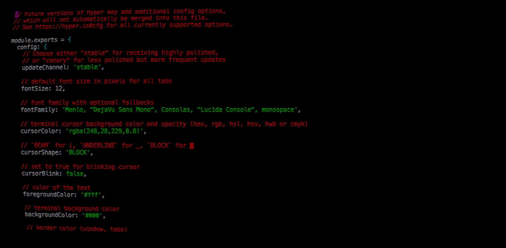

# hyperatompunk

> Atompunk HyperTerm theme adding RGB shifting, tab text-borders, and CRT effect

## Install

Add `hyperatompunk` to the plugins list in your `~/.hyperterm.js` config file.

This was originally a fork of [hyperpunk](https://github.com/staltz/hyperpunk) by [Andre Staltz](https://staltz.com).

Much of the code comes from the [hyper-postprocessing](https://github.com/slammayjammay/hyper-postprocessing) plugin to support the custom shaders which can be found in the `SHADER` variable in `src/index.js`. If you have this plugin installed, you cannot be running any other plugin using hyper-postprocessing.

## License

MIT
